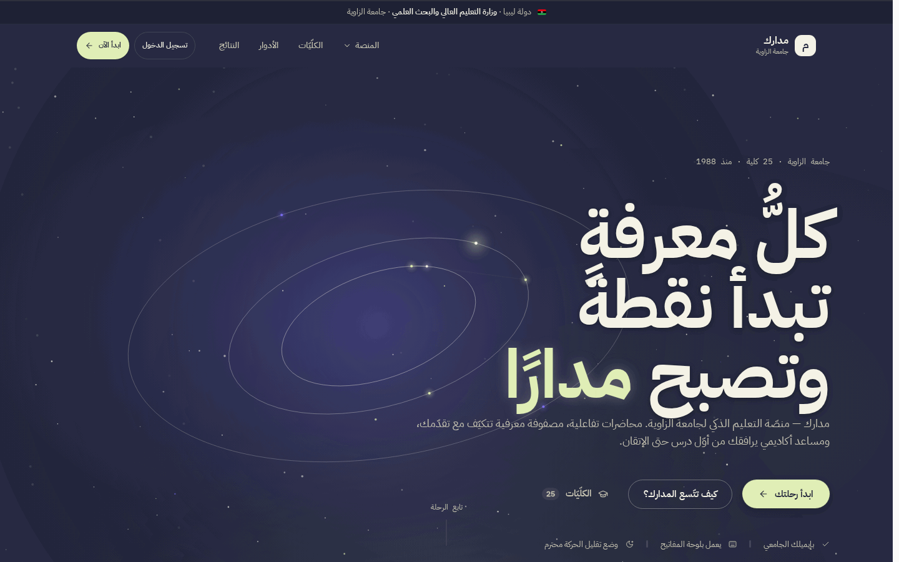
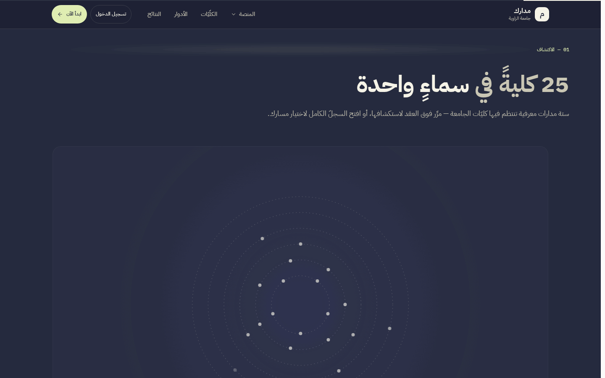
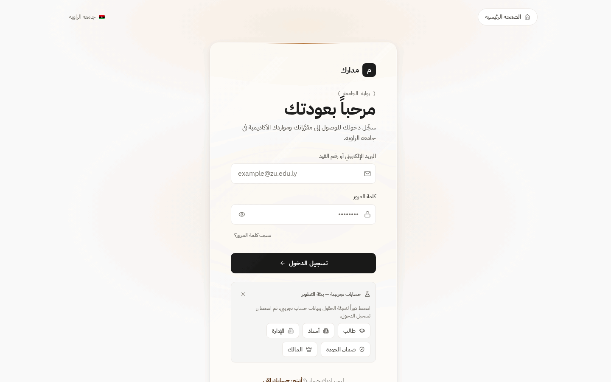
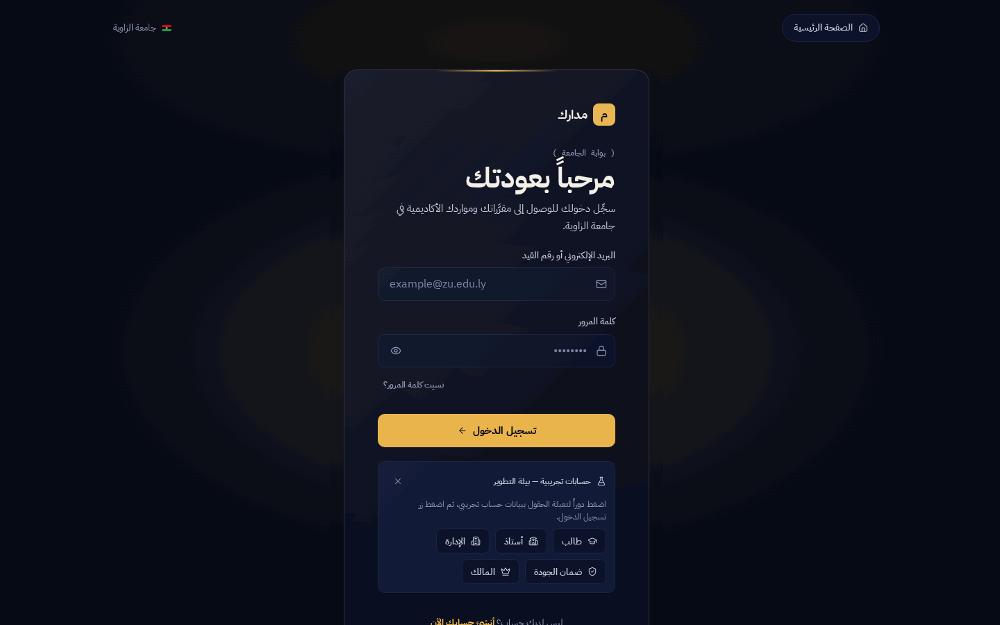
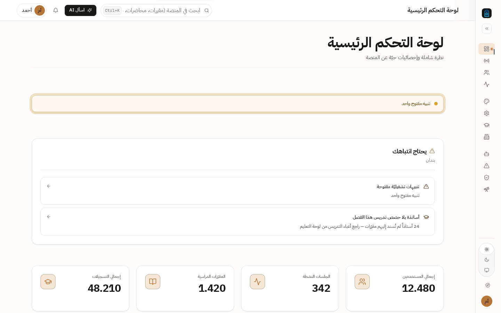
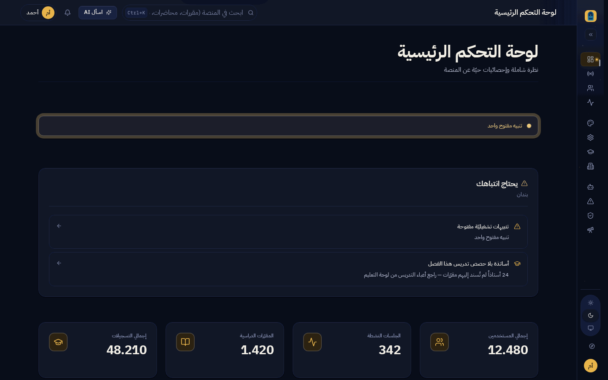

# Madarek — مدارك

> **Zawia University Smart Learning Platform** — the official Arabic-RTL LMS of the University of Zawia (Libya), and the design-system **reference** for the Smart family (Smart-Menu · Smart-Link · SmartBot · Smart-Order).

> 🌐 **English** · the full bilingual README (with the condensed العربية section, deployment guide, environment reference and scripts table) is the canonical doc: [`README.md`](./README.md)



## What is this?

Madarek is two things at once:

1. **A bilingual academy platform** — a complete LMS: flipped classrooms, a per-concept mastery matrix, a research-papers workflow with PDF annotations, cross-document library search, a read-only quality-oversight sector, and DB-driven admin reporting.
2. **The family's design reference** — every Smart product clones its design canon from here: the copper-on-cream / gold-on-night product theme, the IBM Plex Sans Arabic type ladder, the motion canon, elevation, component recipes, and RTL rules. The canon is stated in [`DESIGN.md`](./DESIGN.md) and machine-enforced by the parity gate (163/163 token checks).

## Screenshots

The two design worlds as they ship — 1440×900 stills from the live app:

| | |
|---|---|
| **Orbit Ink landing** |  |
| **Colleges constellation** — the 25-college ring |  |
| **Sign-in · light** — copper on cream |  |
| **Sign-in · dark** — gold on night |  |
| **Owner dashboard · light** — KPIs, doughnut chart, activity feed |  |
| **Owner dashboard · dark** |  |

*Full captions and capture notes: [`docs/screenshots/README.md`](docs/screenshots/README.md) · captions in العربية too.*

## Verify it yourself

```bash
npm test                               # frontend + backend unit suites (no DB needed)
node scripts/verify-parity-export.mjs  # design-parity gate — 163/163 token checks
```

## Quick facts

- **Live:** <https://madarek.onrender.com> · **Deploy:** Render blueprint (`render.yaml`), Neon PostgreSQL
- **Demo accounts** (password `Madarek2026!` after seeding): `student@` / `teacher@` / `admin@` / `quality@` / `owner@zu.edu.ly`
- **Stack:** React 18 + Vite + TypeScript · Express + Prisma · TanStack Query · Zustand · Chart.js — zero animation libraries (CSS-first motion canon)
- **Local dev, gates, env vars, structure:** see the canonical [`README.md`](./README.md)

---

## 🛰️ Part of the Madarek Ecosystem

> One design system across all projects · the Madarek identity: night/gold `#070B16`/`#E9B44C` dark — cream/copper `#FBFAF9`/`#B57438` light — IBM Plex Sans Arabic

| Project | Role | GitHub | Live |
|---|---|---|---|
| 🎓 **Madarek / مدارك** | Smart-learning platform for University of Zawia — the design-system reference | [github.com/ahmadmedo1012/madarek](https://github.com/ahmadmedo1012/madarek) | [madarek.onrender.com](https://madarek.onrender.com) |
| 🔗 **Smart-Link / سمارت لينك** | Digital umbrella for Libyan businesses | [github.com/ahmadmedo1012/Smart-Link](https://github.com/ahmadmedo1012/Smart-Link) | [smart-link.ly](https://smart-link.ly) |
| 🍽️ **Smart Menu / سمارت منيو** | Digital menu & WhatsApp ordering for restaurants | [github.com/ahmadmedo1012/Smart-Menu](https://github.com/ahmadmedo1012/Smart-Menu) | [menu.smart-link.ly](https://menu.smart-link.ly) |
| 🤖 **SmartBot / سمارت بوت** | Messenger bot & automation for Facebook pages | [github.com/ahmadmedo1012/SmartBot](https://github.com/ahmadmedo1012/SmartBot) | [bot.smart-link.ly](https://bot.smart-link.ly) |
| 🛍️ **Smart Order / سمارت أوردر** | Digital storefront, orders & delivery for businesses | [github.com/ahmadmedo1012/Smart-Order](https://github.com/ahmadmedo1012/Smart-Order) | [order.smart-link.ly](https://order.smart-link.ly) |
