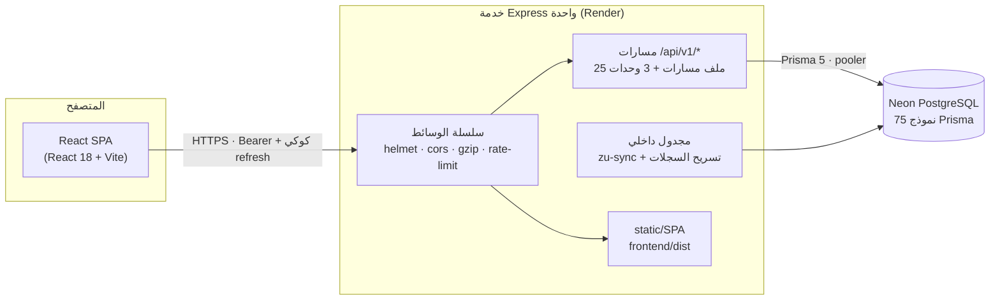
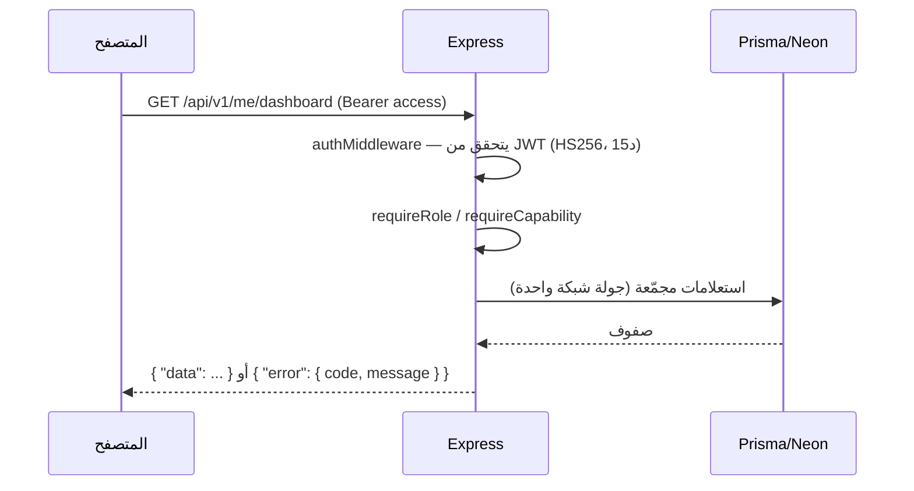
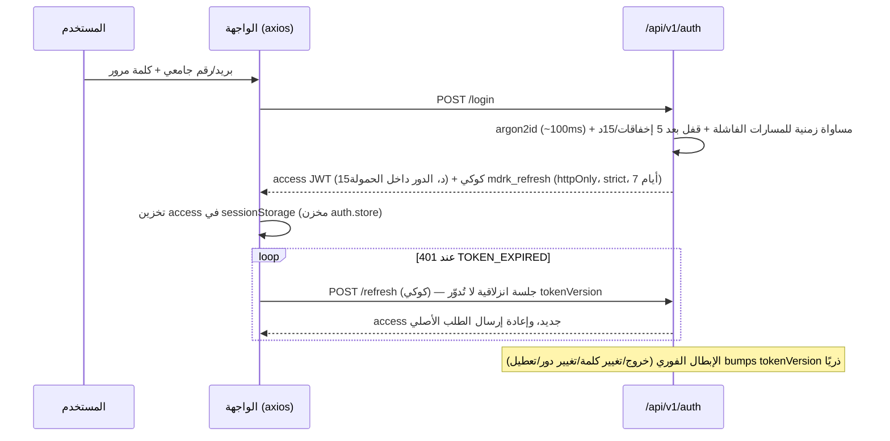

# 03 — المعمارية التقنية

## الصورة الكبيرة

مدارك **خدمة ويب واحدة**: في الإنتاج تشغّل عملية Express واحدة تخدم
واجهات API تحت `/api/v1/*` وملفات الواجهة المبنية (SPA) من `frontend/dist`
في كل مسار آخر. قاعدة البيانات PostgreSQL مُدارة (Neon) عبر Prisma. لا
طوابير مهام، لا Redis، لا WebSocket — العمليات الخلفية اليومية داخل
مجدول داخلي في العملية نفسها.

## تدفق الطلب عبر الخلفية

الترتيب في `backend/src/app.ts` (`createApp()`):

1. `helmet` برأس CSP صارم (انظر [10-security](10-security.md)) — بشرتين
   `sha256` لسكربتَي `frontend/index.html` الداخليين.
2. `cors` بقائمة سماح (لا أحرف بديلة؛ الاعتمادات مفعّلة).
3. ضغط gzip مخصص على `node:zlib` (عتبة 1KB، فلتر MIME، `Vary` دائمًا).
4. `express.json` + urlencoded بحد 1MB، ثم `cookieParser`.
5. `GET /api/v1/health` — فحص حي يسبق كل شيء: `SELECT 1` بمهلة 5 ثوانٍ
   (امتصاص بدء تشغيل Neon البارد)، يرد `{ ok, dbLatencyMs, env, buildId }`.
6. `rate limiter` عام: 1000 طلب/15 دقيقة/IP على `/api/v1`.
7. 28 راوترًا مجمّعًا (25 ملف مسارات + وحدات theme/onboarding/milestones).
8. 404 JSON لأي `/api/*` غير معروف («المسار المطلوب غير موجود»).
9. في الإنتاج فقط: static ثلاثي الطبقات (`/assets` سنة كاملة immutable،
   بقية الملفات ساعة، `index.html` بلا تخزين) + SPA fallback يستثني `/api`.
10. `errorHandler` الأخير دائمًا.

## المصادقة والجلسات

قرارات مسندة: **D3** (جلسة انزلاقية بلا تدوير عند كل refresh — مقايضة
موثقة)، **D4** (access في sessionStorage — مقايضة XSS معلنة، والـrefresh
في كوكي httpOnly). التفصيل الأمني الكامل: [10-security](10-security.md).

## التفويض: أدوار + قدرات

خمسة أدوار (`STUDENT | TEACHER | ADMIN | QUALITY | OWNER`)، وفوقها نموذج
قدرات (17) في `backend/src/lib/permissions.ts`:
`DEFAULT_ROLE_CAPABILITIES[role] ∪ RolePermission (كاش 30 ثانية) + UserPermission`.
حرّاس القراءة التوأم: `assertOfferingAccess` (قرار نقي مُختبر) و
`offeringVisibilityFilter` (مرشّح Prisma). الحاكمية في `lib/governance.ts`:
قفل «آخر مالك نشط» ونطاق كليات (`scopeFacultyId`) وتوفير بروفايل عند
ترقية معلم.

## معالجة الأخطاء والتحقق

- التحقق: `validate(schema, source)` بالـZod يستبدل `req.body/query/params`
  بالقيمة المحللة؛ فشل = 400 `VALIDATION_ERROR` برسالة عربية وتفاصيل
  إنجليزية (سياسة D17-3: **الأكواد إنجليزية والرسائل عربية**).
- `errorHandler` بترتيب: `AppError` → `ZodError` → أخطاء Prisma معروفة
  (P2002→409، P2025→404، P2003→400) → رفض body-parser (400/413/415) →
  500 عام بلا تسريب. كل 5xx يرفع `OperationalAlert` (بخنق 5 دقائق/كود،
  أفضل-جهد لا يكسر الطلب).
- الظرف الموحد: نجاح `{ data, meta? }`، خطأ `{ error: { code, message, details? } }`؛
  الحذف يرد `{ data: { ok: true } }` (لا 204).

## المجدول والعمليات الخلفية

`backend/src/scheduler.ts`: نبضة عند الإقلاع (+5 ثوانٍ) ثم كل 24 ساعة
(مؤقتات `unref`):
1. `runSyncGuarded` — مزامنة حقائق الجامعة بحرس تزامن مشترك مع الزناد
   اليدوي من الإدارة (لا يتنافسان).
2. تسريح `LoginEvent` الأقدم من 180 يومًا (دفعات 5000، سقف 200 دفعة/يوم).

كلاهما «لا يرمي أبدًا». ملاحظة موثقة: مع تعدد النسخ يجب استبداله بـcron
خارجي أو طابور مهام (انظر [16](16-decisions-and-limitations.md)).

## الواجهة: البنية والحالة

- **الإقلاع**: `main.tsx` يحمّل CSS بترتيب مقصود (fonts→tokens→motion→base→
  components→layout→…)؛ `App.tsx` يغلّف كل الصفحات بـ`React.lazy` مع
  Suspense مزدوج، و`HomeRedirect` يوجه `/` حسب الدور.
- **المخازن (Zustand)**: `auth` (جلسة + isHydrated)، `theme` (سمتا
  light/dark/system، افتراضي داكن، إصدار persist v2)، `ui` (حالة الشريط
  الجانبي)، `onboarding`. بقية حالة الخادم عبر **TanStack Query 5**
  (staleTime 30 ثانية، إعادة محاولة لـ5xx فقط، `queryClient.clear()` عند
  كل حدود الجلسة لمنع تسرب بيانات حساب على جهاز مشترك).
- **طبقة API**: `lib/api.ts` (axios، بادئة `/api/v1`، اعتراض 401→refresh→
  إعادة إرسال)، والهوكات مجمّعة في `hooks/useResources.ts` (~120 هوك)
  و`useOwner.ts` و`useAuth.ts` وبعضها محلي بالصفحات (الجودة).
- **التصميم**: CSS عادي بطبقات `@layer` وسمات `[data-theme]` ولمسات دور
  `body[data-role]`؛ حركة عبر رموز فقط؛ أيقونات Lucide فقط؛ خطوط
  IBM Plex Sans Arabic مستضافة ذاتيًا. التفصيل: [modules/platform.md](modules/platform.md).

## قاعدة البيانات — التجريد

75 نموذجًا و30 enum و16 ترحيلًا. المجموعات: الهوية والحاكمية، الكتالوج
والتدريس، الحضور، المحتوى التعليمي، البحوث، الاختبارات، التدريب،
المكتبة/MOOC/الوظائف، الاجتماعي، المختبرات/AR، الذكاء، التشغيل.
التفصيل الكامل: [07-database.md](07-database.md) و
[DATABASE-REFERENCE.md](DATABASE-REFERENCE.md).

## المناطق الزمنية (قرار موثق)

اللحظات تُخزن UTC؛ مفاتيح الأيام الحسابية على تقويم UTC (تفرد الحضور
`@@unique(offeringId, date)`)؛ والتسميات المعروضة بتقويم **Africa/Tripoli**
حسابيًا عبر `Intl` (ليس +2 مقيدًا) — `backend/src/lib/dates.ts`، مع تثبيت
`TZ=UTC` في `render.yaml` لضمان حواف أيام صحيحة.

## مقايضات معمارية معلنة

| القرار | السبب | الأثر |
|---|---|---|
| خدمة واحدة + SPA من Express | بساطة النشر على Render المجاني | توسع أفقي يتطلب طبقة static مستقلة لاحقًا |
| حالة تشغيلية في الذاكرة (حدود معدل، كاش قدرات، خنق تنبيهات) | لا Redis | تُعاد بعد إعادة التشغيل؛ تتفرق بين نسخ متعددة |
| اختبارات بلا DB (وحدات نقية) | سرعة CI واستقراره | لا اختبارات تكامل لمنطق المعاملات والأقفال |
| no-WebSocket | لا حاجة اليوم | «الزمن الحقيقي» في لوحة المالك استقصاء دوري |
